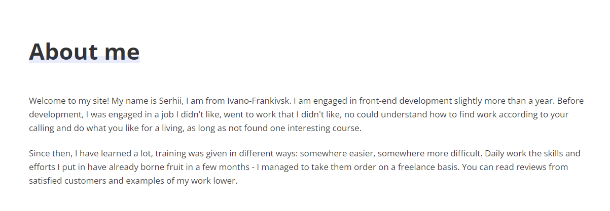
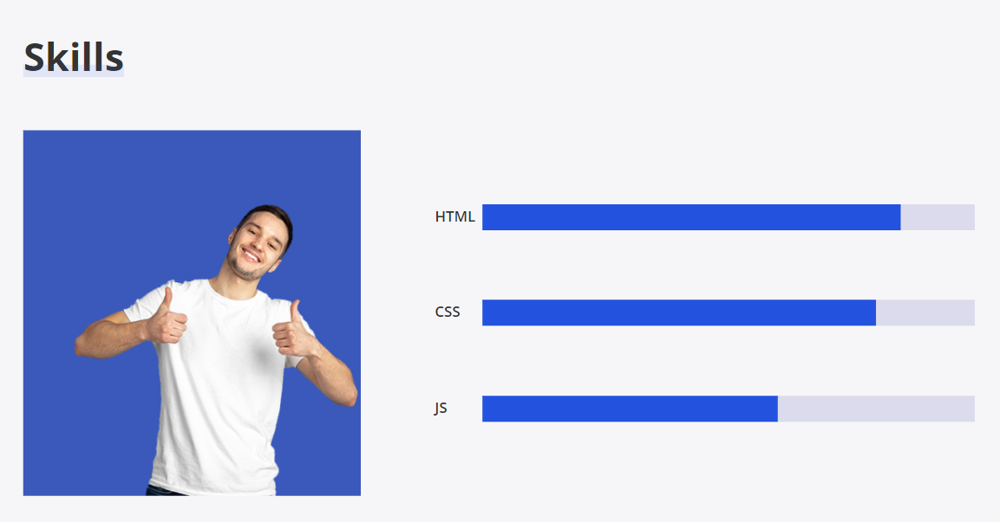

# Serhii's Sirko portfolio

This website is a portfolio project for Serhii Sirko, a front-end developer. It showcases Serhii's skills in web development and design, including JavaScript, CSS, and HTML.

This website is for anyone who is interested in learning more about Serhii's work as a front-end developer. It provides a glimpse into his skills, experience, and portfolio, contact information.

## Features

This site is designed as single page application, which consist of the following parts:

### Existing Features

- __Navigation Bar__

    - The full responsive navigation bar includes links to the Logo (Home page), About me, Skills, Services, Portfolio, Reviews and Contacts section and is identical in each section to allow for easy navigation.
    - This section will allow the user to easily navigate from section to section across all devices without having to revert back to the previous page via the ‘back’ button.
     
    - It will Collapse on smaller screen sizes to make it more manageable and visually pleasing
  
      
  
      

- __The landing page image__

    - The landing includes a photograph with text overlay to allow the user to see exactly what is this site about.
    - This section introduces the user to Serhii Sirko with attention to his portfolio.

- __About me Section__

    - This section gives brief introduction about Serhii.
  

- __Skills section__

    - This section will allow the user to see Serhii's main skills.
  

### Features Left to Implement

- Lazy loading on load more button

## Testing

This section demonstrates my comprehensive manual testing efforts undertaken to validate the functionality and user experience of my website. Through rigorous testing, I aimed to verify that all features operate as intended, offering a smooth and intuitive journey for users across diverse browsers and screen sizes.

**Testing Methodology:**

* **Feature Exploration:** I meticulously explored each website feature, simulating real user interactions and scenarios. This covered core functionalities like [list key features].
* **Positive & Negative Testing:** I devised and executed test cases encompassing both positive scenarios – confirming expected behavior – and negative scenarios – actively triggering potential errors and edge cases.
* **Cross-Browser Compatibility:** I rigorously tested the website across major browsers (e.g., Chrome, Firefox, Safari) and various screen sizes (desktop, mobile) to ensure optimal performance and visual consistency.

**Key Findings:**

* **Functionality:** All tested features performed flawlessly, enabling users to achieve their goals (e.g., [mention specific user goals achieved]).
* **User Experience:** Interactions were intuitive and responsive, fostering a seamless experience across devices and screen sizes.
* **Visual Consistency:** The website maintained consistent layouts and aesthetics across browsers and screen sizes, preserving a polished and professional appearance.

**Conclusion:**

Through meticulous manual testing, I identified and addressed any potential issues within the website. This ensures a robust and user-friendly experience for all visitors, fostering confidence in its quality and effectiveness.

### Validator Testing

- HTML
    - No errors were returned when passing through the official W3C validator
  

- CSS
    - No errors were found when passing through the official (Jigsaw) validator

### Unfixed Bugs

You will need to mention unfixed bugs and why they were not fixed. This section should include shortcomings of the frameworks or technologies used. Although time can be a big variable to consider, paucity of time and difficulty understanding implementation is not a valid reason to leave bugs unfixed.

## Deployment

- The site was deployed to GitHub pages. The steps to deploy are as follows:
    - In the GitHub repository, navigate to the Settings tab
    - From the source section drop-down menu, select the main branch
    - Once the main branch has been selected, the page will be automatically refreshed with a detailed ribbon display to indicate the successful deployment.

The live link can be found here - https://svdotsenko.github.io/portfolio-project-1

## Credits

### Content & Media 

I implemented this [mockup](https://www.figma.com/file/h0f2OcCTHy0Nu2jKlywjbs/%D0%9F%D0%BE%D1%80%D1%82%D1%84%D0%BE%D0%BB%D1%96%D0%BE?type=design&node-id=0%3A1&mode=dev)