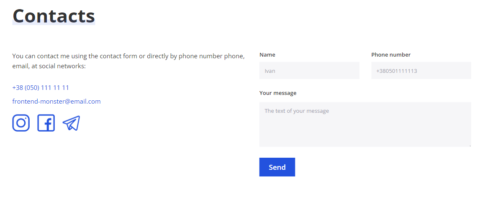
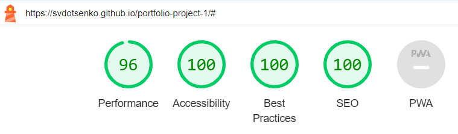

# Serhii's Sirko portfolio

This website is a portfolio project about Serhii Sirko, a front-end developer. It showcases Serhii's skills in web development and design, including JavaScript, CSS, and HTML.

This website is for anyone who is interested in learning more about Serhii's work as a front-end developer. It provides a glimpse into his skills, experience, and portfolio, contact information.

## Features

This site is designed as single page application, which consist of the following parts:

### Existing Features

- __Navigation Bar__

    - The full responsive navigation bar includes links to the Logo (Home page), About me, Skills, Services, Portfolio, Reviews and Contacts section and is identical in each section to allow for easy navigation.
    - This section will allow the user to easily navigate from section to section across all devices without having to revert back to the previous page via the ‘back’ button.
     
    - It will Collapse on smaller screen sizes to make it more manageable and visually pleasing
  
      
  
      

- __The landing page image__

    - The landing includes a photograph with text overlay to allow the user to see exactly what is this site about.
    - This section introduces the user to Serhii Sirko with attention to his portfolio.

- __About me Section__

    - This section gives brief introduction about Serhii.
  

- __Skills section__

    - This section will allow the user to see Serhii's main skills.
  

- __Services section__

    - This section will allow the user to see services which Serhii can provide.

- __Portfolio section__

    - This section will allow the user to see services projects which Serhii has already done.

- __Customer review section__

    - This section will allow the user to see customer review.

- __Statistics section__

    - This section will allow the user to see statistics about Serhii's work.

- __Contacts section__

    - This section will allow the user to see how to contact with Serhii.

### Features Left to Implement

- Lazy loading on load more button

## Testing

* I tested that this page works in different browsers: Chrome, Firefox, Safari.
* I confirmed that this project is responsive, looks good and functions оп ап standard screen sizes using the
devtools device toolbar.
* I confirmed that the all sections аrе readable and easy to understand.
* I have confirmed that the form works: requires entries in every field, and the submit button works.

### Validator Testing

- HTML
    - No errors were returned when passing through the official W3C validator
  

- CSS
    - No errors were found when passing through the official (Jigsaw) validator

- Accessibility  
  - I confirm that the colors and fonts chosen are easy to read and accessible by running it through lighthouse in devtools. 

## Deployment

- The site was deployed to GitHub pages. The steps to deploy are as follows:
    - In the GitHub repository, navigate to the Settings tab
    - From the source section drop-down menu, select the main branch
    - Once the main branch has been selected, the page will be automatically refreshed with a detailed ribbon display to indicate the successful deployment.

The live link can be found [here](https://svdotsenko.github.io/portfolio-project-1)

## Credits

### Content & Media 

- I implemented this [mockup](https://www.figma.com/file/h0f2OcCTHy0Nu2jKlywjbs/%D0%9F%D0%BE%D1%80%D1%82%D1%84%D0%BE%D0%BB%D1%96%D0%BE?type=design&node-id=0%3A1&mode=dev)
 